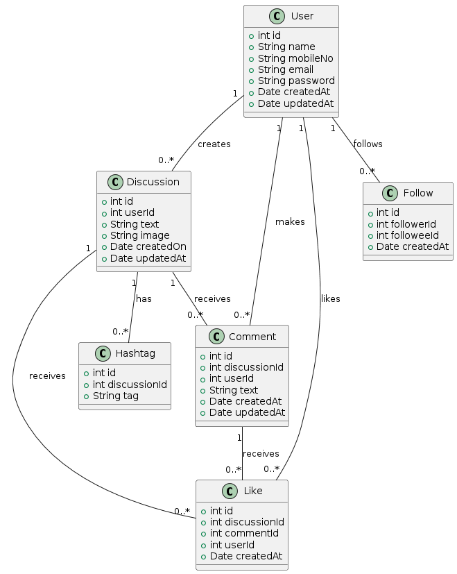

This is a boilerplate Node.js project using Express, MongoDB, Bcrypt for password hashing, JWT for authentication, and environment setup with dotenv. It includes a Postman collection for testing API endpoints.

## Installation
Clone the repository:

bash
Copy code
git clone <repository-url>
cd <project-folder>
Install dependencies:

```bash
npm install
```
## Environment Setup

To set up your environment for this project, create a `.env` file in the root directory and add the following variables:

```bash
PORT=3001
BASE_URL=0.0.0.0
TEST_PORT=3002
DB_NAME=ExpressBoiler
MONGO_URI=mongodb+srv:/xxxxxashclusters.ej6nn1h.mongodb.net/EcommerceDB?retryWrites=true&w=majority
PRIVATE_TOKEN_KEY=Ashutosh
```
Start the server:

```bash
npm start or nodemon server.js
```
The server will run at http://localhost:3001.

Postman Collection
Import the provided Spyne.postman_collection.json into Postman.
Import the environment variables from SpyneEnv.json included in this repository.
Testing API Endpoints
Use the imported Postman collection to test the API endpoints.
Ensure the environment variables in Postman (SpyneEnv) are correctly set up to reflect your local or remote server configurations.
Database Structure
The MongoDB database (EcommerceDB) structure should match the models and schemas defined in your project.
Collection Relationship Diagram
The relationship diagram for the Postman collection (Collection Definitions and Relationships.PDF) showcases the structure and dependencies of API endpoints.
## UML Diagram



Feel free to customize this README.md according to your project's specific details and requirements. Adjust the installation steps, environment variables, and any additional setup instructions as needed.
